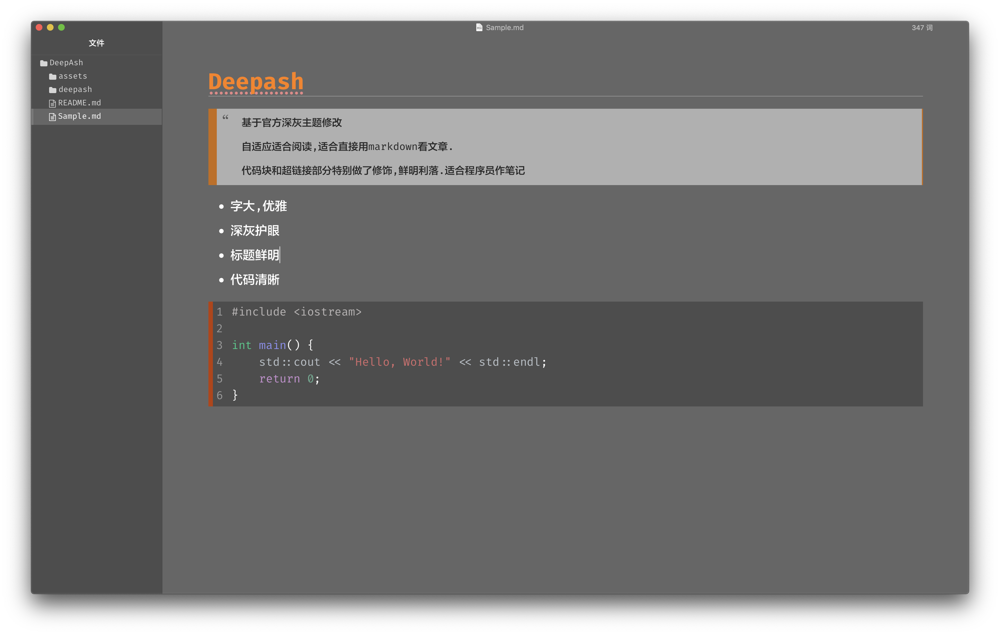
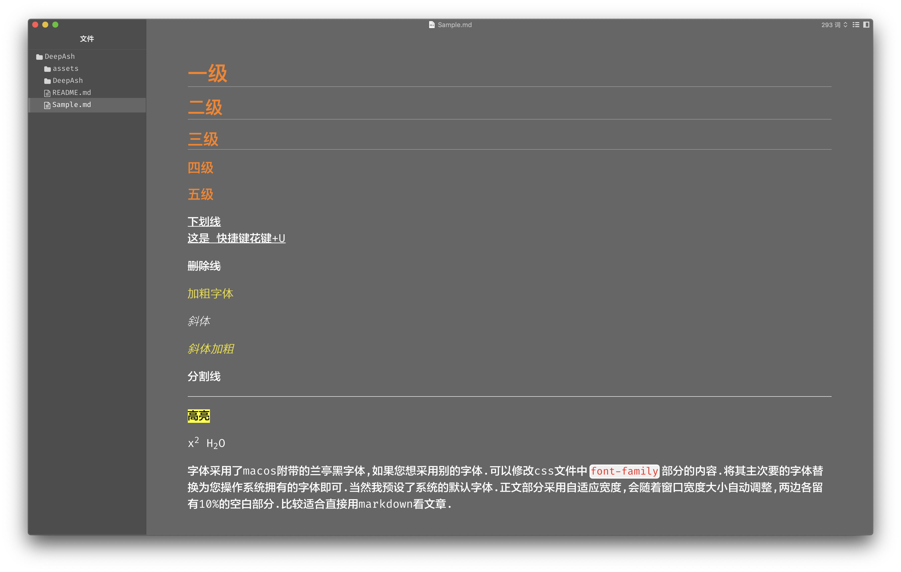
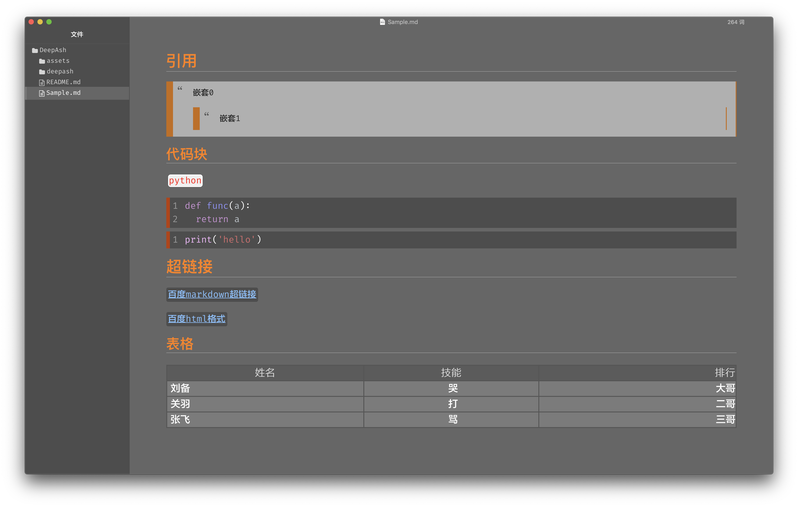
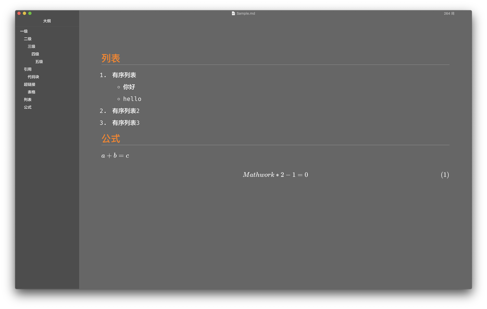

# typora.theme.deepash
基于typora官方ash修改的主题



## 测试版本

Mac 10.14 typora 0.11.16

## 安装

- 下载压缩包或者release资源并解压
- 找到对应的主题文件夹,将deepash.css和deepash文件夹拷贝到主题文件夹下
- 选择Deepash主题

## 效果展示







# FAQ

## 1.遇到字体不兼容

macos和linux和window可能没有对应的字体,对应需要修改deepash.css文件中font-family字段

```css
font-family: 'FiraCode-Regular','FZLTZHK--GBK1-0', sans-serif;
```

我在mac上使用的字体顺序是 firacode>兰亭黑>默认字体

firacode只是英文字体,网上可以下载.

如果是window系统,建议中文字体使用微软雅黑.
